

# **G**enerative **Ra**tio **M**atching Networks

Akash Srivastava$^{\ast,1,2}$, Kai Xu$^{\ast,3}$, Michael U. Gutmann$^{3}$, Charles Sutton$^{3,4,5}$

      

$\ast$ denotes equal contributions
$^1$MIT-IBM Watson AI Lab $^2$IBM Research $^3$University of Edinburgh $^4$Google AI $^5$Alan Turing Institute

 

To appear in ICLR 2020; OpenReview: https://openreview.net/forum?id=SJg7spEYDS

---

## Introduction and motivations

Implicit deep generative models: $x = \mathrm{NN}(z; \theta)$ where $z \sim$ noise

Maximum mean discrepancy networks (MMD-nets)

- :x: can only work well with **low-dimensional** data
- :white_check_mark: are very **stable** to train by avoiding the saddle-point optimization problem

Adversarial generative models (e.g. GANs, MMD-GANs)

- :white_check_mark: can generate **high-dimensional** data such as natural images
- :x: are very **difficult** to train due to the saddle-point optimization problem

Q: Can we have two :white_check_mark::white_check_mark:? 
A: Yes. Generative ratio matching (GRAM) is a *stable* learning algorithm for *implicit* deep generative models that does **not** involve a saddle-point optimization problem and therefore is easy to train :tada:.

---

## Background: **maximum mean discrepancy**

The maximum mean discrepancy (MMD) between two distributions $p$ and $q$ is defined as
$$
\mathrm{MMD}_\mathcal{F}(p,q) = \sup_{f\in\mathcal{F}} \left(\mathbb{E}_p \lbrack f(x) \rbrack - \mathbb{E}_q \lbrack f(x) \rbrack \right)
$$
Gretton et al. (2012) shows that it is sufficient to choose $\mathcal{F}$ to be a unit ball in an reproducing kernel Hilbert space (RKHS) $\mathcal{R}$ with a characteristic kernel $k$ s.t.
$$
\mathrm{MMD}_\mathcal{F}(p, q) = 0 \iff p = q
$$
The empirical estimate of the (squared) MMD with $x_i \sim p$ and $y_j \sim q$ by Monte Carlo is
$$
\hat{\textmd{MMD}}^2_\mathcal{R}(p,q) =
\frac{1}{N^2}\sum_{i=1}^N\sum_{i'=1}^N k(x_i,x_{i'})
- \frac{2}{NM}\sum_{i=1}^N\sum_{j=1}^M  k(x_i, y_j)
 + \frac{1}{M^2}\sum_{j=1}^M\sum_{j'=1}^M k(y_j,y_{j'})
$$
MMD-nets trains neural generators by minimizing this empirical estimate.

---

## Background: **density ratio estimation via moment matching**

Density ratio estimation: find $\hat{r}(x) \approx r(x) = \frac{p(x)}{q(x)}$ with samples from $p$ and $q$

Finite moments under the fixed design setup gives $\hat{\mathbf{r}}_q = [\hat{r}(x_1^q), ..., \hat{r}(x_M^q)]$ for $x^q \sim q$

$$
\min_r \left ( \int \phi(x)p(x) dx - \int \phi(x)r(x)q(x) dx \right )^2
$$

Huang et al. (2007) shows that by changing $\phi(x)$ to $k(x; .)$, where $k$ is a characteristic kernel in RKHS, we can match infinite moments and the optimization below agrees with the true $r(x)$

$$
\min_{r\in\mathcal{R}} \bigg \Vert \int k(x; .)p(x) dx - \int k(x; .)r(x)q(x) dx \bigg \Vert_{\mathcal{R}}^2
$$

Analytical solution: $\hat{\mathbf{r}} = \mathbf{K}_{q,q}^{-1}\mathbf{K}_{q,p} \mathbf{1}$, where $[\mathbf{K}_{p,q}]_{i,j} = k(x_i^p, x_j^q)$ given samples $\{x_i^p\}$ and $\{x_j^q\}$.

---

## GRAM: an overview

Two targets in the training loop

1. Learning a projection function $f_\theta$ that maps the data space into a low-dimensional manifold which preserves the density ratio between data and model.
   - "Preserves": $\frac{p_x(x)}{q_x(x)} = \frac{\bar{p}(f_\theta(x))}{\bar{q}(f_\theta(x))}$, measured by $D(\theta) = \int q_x(x) \left( \frac{p_x(x)}{q_x(x)} - \frac{\bar{p}(f_\theta(x))}{\bar{q}(f_\theta(x))} \right)^2 dx$
   - :question: $\frac{p_x(x)}{q_x(x)}$ is hard to estimate in the high-dimensional space ...
2. Matching the model $G_\gamma$ to data in the low-dimensional manifold by minimizing MMD
   - :thumbsup: MMD works well in low dimensional space
   - $\mathrm{MMD} = 0$ :arrow_right: $\frac{\bar{p}(f_\theta(x))}{\bar{q}(f_\theta(x))} = 1$ :arrow_right: $\frac{p_x(x)}{q_x(x)} = 1$

Both with empirical estimates based on samples from the data $\{x_i^p\}$ and the model $\{x_j^q\}$.

$f_\theta$ and $G_\gamma$ are simultaneously updated.

---

## GRAM: tractable ratio matching

:one: Learning the projection function $f_\theta(x)$ by minimizing the squared difference
$$
\begin{aligned}
D(\theta) 
&= \int q_x(x) \left( \frac{p_x(x)}{q_x(x)} - \frac{\bar{p}(f_\theta(x))}{\bar{q}(f_\theta(x))} \right)^2 dx \\
&= C - 2 \int p_x(x) \frac{\bar{p}(f_\theta(x))}{\bar{q}(f_\theta(x))} dx + \int q_x(x) \left( \frac{\bar{p}(f_\theta(x))}{\bar{q}(f_\theta(x))} \right)^2 dx \\
&= C - 2 \int \bar{p}(f_\theta(x)) \frac{\bar{p}(f_\theta(x))}{\bar{q}(f_\theta(x))} df_\theta(x) + \int \bar{q}(f_\theta(x)) \left( \frac{\bar{p}(f_\theta(x))}{\bar{q}(f_\theta(x))} \right)^2 df_\theta(x) \\
&= C' -  \left( \int \bar{q}(f_\theta(x)) \left( \frac{\bar{p}(f_\theta(x))}{\bar{q}(f_\theta(x))} \right)^2 df_\theta(x) - 1 \right) = C' - \mathrm{PD}(\bar{q}, \bar{p})
\end{aligned}
$$
... or by equivalently maximizing the Pearson divergence :smile:.

A reminder on LOTUS: $\int p(x) g(f(x)) dx = \int p(f(x)) g(f(x)) d f(x)$

 

[1]: A derivation of the reverse order for a special case of projection functions was also shown in (Sugiyama et al., 2011).
</dvi>

---

## GRAM: Pearson divergence maximization

Monte Carlo approximation of PD
$$
\mathrm{PD}(\bar{q}, \bar{p}) = \int \bar{q}(f_\theta(x)) \left( \frac{\bar{p}(f_\theta(x))}{\bar{q}(f_\theta(x))} \right)^2 df_\theta(x) - 1  \approx \frac{1}{N} \sum_{i=1}^N \left( \frac{\bar{p}(f_\theta(x_i^q))}{\bar{q}(f_\theta(x_i^q))} \right)^2 - 1
$$
where $x^q_i \sim q_x$ or equivalently $f_\theta(x^q_i) \sim \bar{q}$.

Given samples $\{x_i^p\}$ and $\{x_j^q\}$, we use the density ratio estimator based on infinite moments matching (Huang et al., 2007, Sugiyama et al., 2012) under the fixed-design setup
$$
\hat{\mathbf{r}}_{q,_\theta} = \mathbf{K}^{-1}_{q,q} \mathbf{K}_{q,p}\mathbf{1} = [\hat{r}_\theta(x_1^q), ..., \hat{r}_\theta(x_M^q)]^\top
$$
where $[\mathbf{K}_{p,q}]_{i,j} = k(f_\theta(x_i^p), f_\theta(x_j^q))$ and  $r_\theta(x) = \frac{\bar{p}(f_\theta(x))}{\bar{q}(f_\theta(x))}$.

---

## GRAM: matching projected model to projected data

:two: Minimizing the empirical estimator of MMD in the low-dimensional manifold

$$
\begin{aligned}
\min_\gamma \Bigg[&\frac{1}{N^2}\sum_{i=1}^N\sum_{i'=1}^N k(f_\theta(x_i),f_\theta(x_{i'})) 
- \frac{2}{NM}\sum_{i=1}^N\sum_{j=1}^M  k(f_\theta(x_i), f_\theta(G_\gamma(z_j)))\\
&\quad + \frac{1}{M^2}\sum_{j=1}^M\sum_{j'=1}^M k(f_\theta(G_\gamma(z_j)),f_\theta(G_\gamma(z_{j'}))) \Bigg ]
\end{aligned}
$$

with respect to its parameters $\gamma$.

---

## GRAM: the complete algorithm

Loop until convergence

1. Sample a minibatch of data and generate samples from $G_\gamma$
2. Project data and generated samples using $f_\theta$
3. Compute the kernel Gram matrices using Gaussian kernels in the projected space
4. Compute the objectives for $f_\theta$ and $G_\gamma$ using the same kernel Gram matrices
5. Backprop two objectives to get the gradients for $\theta$ and $\gamma$
6. Perform gradient update for $\theta$ and $\gamma$

 

:sunglasses: Fun fact: the objectives in our GRAM algorithm both heavily relies on the use of kernel Gram matrices.

---

## How do GRAM-nets compare to other deep generative models

| GAN | MMD-net | MMD-GAN | GRAM-net |
| - | - | - | - |
| 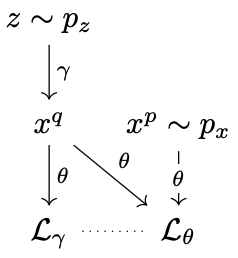 | 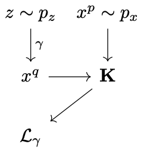 | 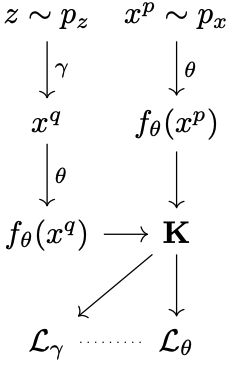 | 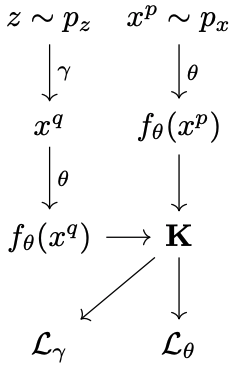 |

---

## Illustration of GRAM training

| | |
| - | - |
| 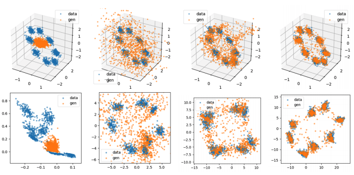 | 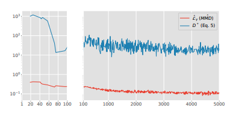 |

Blue: data, Orange: samples
Top: original, Bottom: projected

---

## Evaluations: the stability of models

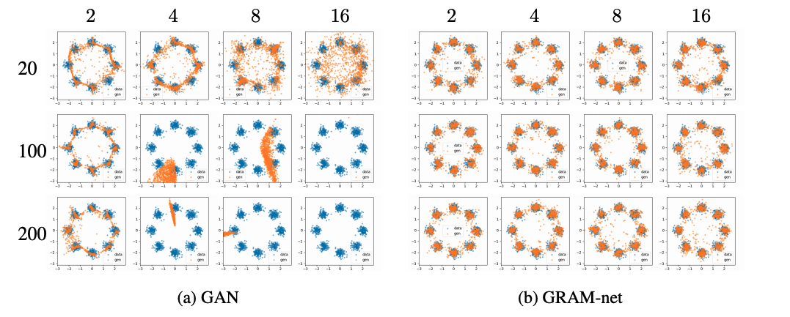

x-axis = noise dimension and y-axis = generator layer size

---

## Evaluations: the stability of models (continued)

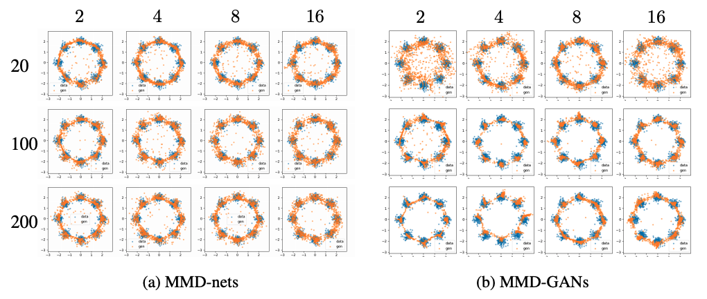

x-axis = noise dimension and y-axis = generator layer size

---

## Quantitative results: sample quality

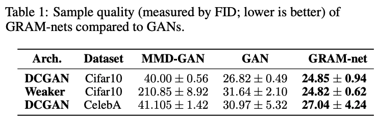

---

## Qualitative results: random samples

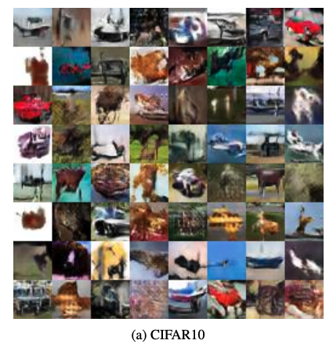 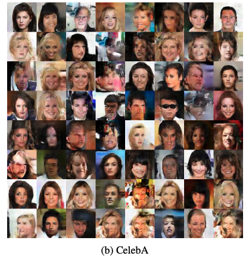

---

## The end
