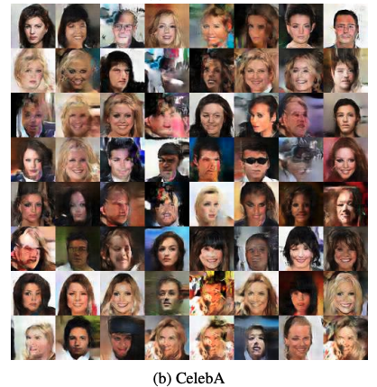

# **G**enerative **Ra**tio **M**atching Networks

Akash Srivastava$^{\ast,1,2}$, Kai Xu$^{\ast,1}$, Michael U. Gutmann$^{1}$, Charles Sutton$^{1,3,4}$

 

$\ast$ equal contributions
$^1$ University of Edinburgh $^2$ MIT-IBM Watson AI Lab $^3$ Google AI $^4$ Alan Turing Institute

---

## Goal

A *stable* learning algorithm for *implicit* deep generative models with *high* dimensional data

- MMD networks are stable but perform poorly on high dimensional data
- Adversarial methods with zero-sum games (GANs, MMD-GANs, etc) can scale up to high dimensional (image) data but are not stable in general

---

## Key Ideas

1. Learn a low-dimensional sub-space projection in which the density ratio between the data and the generator is close to the density ratio in the original space
2. Train the generator via the MMD loss in this space

---

## Learning Low Dimensional Sub-space Projection $f_\theta(x)$

We'd like to learn a parameterized transformation $f_\theta(x)$ by minimising the squared difference between the pair of density ratios:

$$
\begin{aligned}
D(\theta) 
&= \int q_x(x) \left( \frac{p_x(x)}{q_x(x)} - \frac{\bar{p}(f_\theta(x))}{\bar{q}(f_\theta(x))} \right)^2 dx \\
&= C -  \left( \int \bar{q}(f_\theta(x)) \left( \frac{\bar{p}(f_\theta(x))}{\bar{q}(f_\theta(x))} \right)^2 df_\theta(x) - 1 \right)\\ 
&= C - \mathrm{PD}(\bar{q}, \bar{p})
\end{aligned}
$$

We can *minimise* the squared difference by *maximizing* Pearson Divergence in the low dimensional space :heart:

---

## Pearson Divergence Maximisation

We carry out a Monte Carlo approximation,
$$
\mathrm{PD}(\bar{q}, \bar{p}) \approx \frac{1}{N} \sum_{i=1}^N \left( \frac{\bar{p}(f_\theta(x_i))}{\bar{q}(f_\theta(x_i))} \right)^2 - 1 
$$
where $x^q_i \sim q_x$.

<!-- For this to work, we need an estimator of the density ratio. -->
<!-- - We only need density ratios $\frac{\bar{p}(f_\theta(x))}{\bar{q}(f_\theta(x))}$ for a set of samples from $q$ during MC. -->
We use a MMD based density ratio estimator (Sugiyama et al., 2012) under the fixed-design setup: $\hat{r}_q = \mathbf{K}^{-1}_{q,q} \mathbf{K}_{q,p}\mathbf{1}$.
- $\mathbf{K}_{q,q}$ and $\mathbf{K}_{q,p}$ are Gram matrices defined by $[\mathbf{K}_{q,q}]_{i,j} = k(f_\theta(x^q_i),f_\theta(x^q_j))$ and $[\mathbf{K}_{q,p}]_{i,j} = k(f_\theta(x^q_i),f_\theta(x^p_j)).$
<!-- - Train the generator via the MMD loss -->
<!-- - Shared Gram matrix between density ratio estimation and generator training
- Simultaneous training of the transform function and the generator -->

---

## Density Ratio Estimation via (Infinite) Moment Matching

*Maximum mean discrepancy*

$$
\textrm{MMD}_{\mathcal{F}}(p,q) = \sup_{f\in\mathcal{F}} \left(\mathbb{E}_p \lbrack f(x) \rbrack - \mathbb{E}_q \lbrack f(x) \rbrack \right)
$$

Gretton et al. (2012) show that it is sufficient to choose $\mathcal{F}$ to be a unit ball in an reproducing kernel Hilbert space $\mathcal{R}$ with a characteristic kernel $k$.

<!-- $$
\hat{\textmd{MMD}}^2_\mathcal{R}(p,q) =
\frac{1}{N^2}\sum_{i=1}^N\sum_{i'=1}^N k(x_i,x_{i'}) 
- \frac{2}{NM}\sum_{i=1}^N\sum_{j=1}^M  k(x_i, y_j)
 + \frac{1}{M^2}\sum_{j=1}^M\sum_{j'=1}^M k(y_j,y_{j'})
$$ -->
Using this definition of MMD, the density ratio estimator $r(x)$ can be derived as the solution to
$$
\min_{r\in\mathcal{R}} \bigg \Vert \int k(x; .)p(x) dx - \int k(x; .)r(x)q(x) dx \bigg \Vert_{\mathcal{R}}^2.
$$

---

## Generator Training

- The generator $G\gamma$ is trained by minimizing the empirical estimator of MMD, 

$$
\begin{aligned}
\min_\gamma \Bigg[&\frac{1}{N^2}\sum_{i=1}^N\sum_{i'=1}^N k(f_\theta(x_i),f_\theta(x_{i'})) 
- \frac{2}{NM}\sum_{i=1}^N\sum_{j=1}^M  k(f_\theta(x_i), f_\theta(G_\gamma(z_j)))\\
&\quad + \frac{1}{M^2}\sum_{j=1}^M\sum_{j'=1}^M k(f_\theta(G_\gamma(z_j)),f_\theta(G_\gamma(z_{j'}))) \Bigg ]
\end{aligned}
$$

with respect to it's parameters $\gamma$.

---
## The Ring dataset: Illustration of the Method and Stability

---

---

---

## Quantitative Results: Sample Quality

---
## Qualitative Results: Random Samples

 