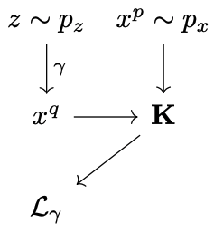
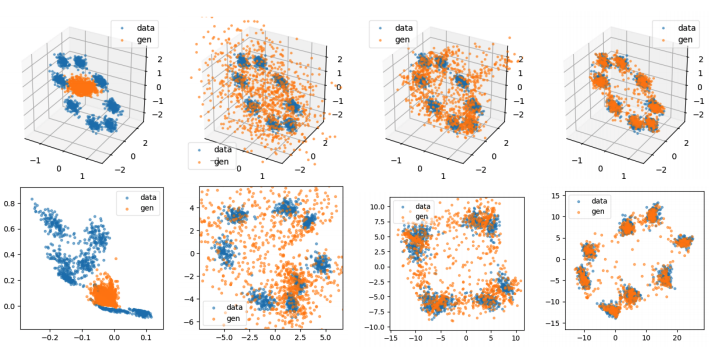
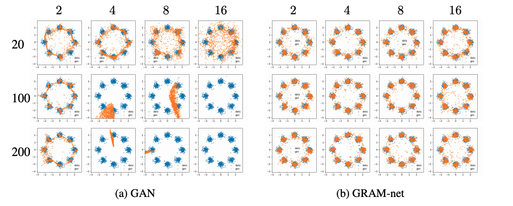
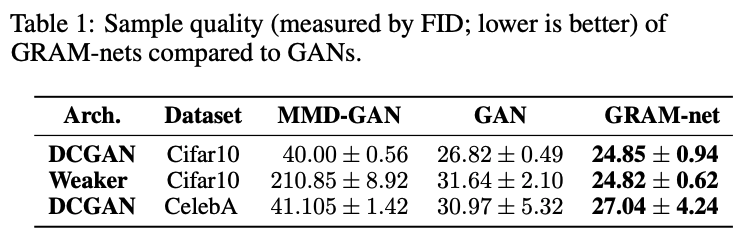

# **G**enerative **Ra**tio **M**atching Networks

Akash Srivastava$^{\ast,1,2}$, Kai Xu$^{\ast,3}$, Michael U. Gutmann$^{3}$, Charles Sutton$^{3,4,5}$

 

$\ast$ equal contributions
$^1$MIT-IBM Watson AI Lab $^2$IBM Research $^3$University of Edinburgh $^4$Google AI
$^5$Alan Turing Institute

---

## Introduction

Adversarial Generative Models(GANs, MMD-GANs)

- :white_check_mark: can generate high-dimensional data such as natural images. 
- :x: are very difficult to train due to the saddle-point optimization problem

*GRaM* is a *stable* learning algorithm for *implicit* deep generative models that does **not** involve a saddle-point optimization problem and therefore is easy to train :tada:

---

## Overview

Two steps in the training loop

1. Learn a projection function ($f_\theta$)
   - that projects the data ($p_x$) and the model ($q_x$) densities into a low-dimensional manifold which,
   - preserves the difference between this pair of densities.
   - We use the ratio ($r(x) = \frac{p_x}{q_x}$) of the two densities as the measure of this difference.
2. Train the model ($G_\gamma$) in the low-dimensional manifold
   - using the *Maximum Mean Discrepancy* criterion as it work very well in low dimensional data.

---

## GRaM: the algorithm

:one: Learn the manifold projection function $f_\theta(x)$ by minimising the squared difference between the pair of density ratios:

$$
\begin{aligned}
D(\theta)
&= \int q_x(x) \left( \frac{p_x(x)}{q_x(x)} - \frac{\bar{p}(f_\theta(x))}{\bar{q}(f_\theta(x))} \right)^2 dx \\
&= C - \mathrm{PD}(\bar{q}, \bar{p})
\end{aligned}
$$

<!-- We can *minimize* the squared difference by *maximizing* Pearson Divergence in the low dimensional space :heart: -->

---

## GRaM: the algorithm (continued)

:two: Train the generator $G\gamma$ by minimizing the empirical estimator of MMD in the low-dimensional manifold,

$$
\begin{aligned}
\min_\gamma \Bigg[&\frac{1}{N^2}\sum_{i=1}^N\sum_{i'=1}^N k(f_\theta(x_i),f_\theta(x_{i'})) 
- \frac{2}{NM}\sum_{i=1}^N\sum_{j=1}^M  k(f_\theta(x_i), f_\theta(G_\gamma(z_j)))\\
&\quad + \frac{1}{M^2}\sum_{j=1}^M\sum_{j'=1}^M k(f_\theta(G_\gamma(z_j)),f_\theta(G_\gamma(z_{j'}))) \Bigg ]
\end{aligned}
$$

---

## GRaM: the algorithm (continued)

### Pearson divergence maximization and density ratio estimation

Monte Carlo approximation of PD,
$$
\mathrm{PD}(\bar{q}, \bar{p}) \approx \frac{1}{N} \sum_{i=1}^N \left( \frac{\bar{p}(f_\theta(x_i))}{\bar{q}(f_\theta(x_i))} \right)^2 - 1
$$
where $x^q_i \sim q_x$.

<!-- For this to work, we need an estimator of the density ratio. -->
<!-- - We only need density ratios $\frac{\bar{p}(f_\theta(x))}{\bar{q}(f_\theta(x))}$ for a set of samples from $q$ during MC. -->
We use a MMD based density ratio estimator (Sugiyama et al., 2012) under the fixed-design setup: $\hat{r}_q = \mathbf{K}^{-1}_{q,q} \mathbf{K}_{q,p}\mathbf{1}$.
- $\mathbf{K}_{q,q}$ and $\mathbf{K}_{q,p}$ are Gram matrices defined by $[\mathbf{K}_{q,q}]_{i,j} = k(f_\theta(x^q_i),f_\theta(x^q_j))$ and $[\mathbf{K}_{q,p}]_{i,j} = k(f_\theta(x^q_i),f_\theta(x^p_j)).$
<!-- - Train the generator via the MMD loss -->
<!-- - Shared Gram matrix between density ratio estimation and generator training
- Simultaneous training of the transform function and the generator -->

---

## How do GRAM-nets compare to other methods

| GAN | MMD-net | MMD-GAN | GRAM-net |
| - | - | - | - |
|  |  |  |  |

---

## Illustration of GRAM training

| | |
| - | - |
|  | Blue: data  Orange: samples   Top: original  Bottom: projected|

---

## Evaluations: the stability of models

x-axis = noise dimension and y-axis = generator layer size

---

## Evaluations: the stability of models (continued)

x-axis = noise dimension and y-axis = generator layer size

---

## Quantitative results: sample quality

---

## Qualitative results: random samples

 

---

## The end

Extra slides to follow...

---

## Density ratio estimation via (infinite) moment matching

### Maximum mean discrepancy

$$
\textrm{MMD}_{\mathcal{F}}(p,q) = \sup_{f\in\mathcal{F}} \left(\mathbb{E}_p \lbrack f(x) \rbrack - \mathbb{E}_q \lbrack f(x) \rbrack \right)
$$

Gretton et al. (2012) show that it is sufficient to choose $\mathcal{F}$ to be a unit ball in an reproducing kernel Hilbert space $\mathcal{R}$ with a characteristic kernel $k$.

<!-- $$
\hat{\textmd{MMD}}^2_\mathcal{R}(p,q) =
\frac{1}{N^2}\sum_{i=1}^N\sum_{i'=1}^N k(x_i,x_{i'}) 
- \frac{2}{NM}\sum_{i=1}^N\sum_{j=1}^M  k(x_i, y_j)
 + \frac{1}{M^2}\sum_{j=1}^M\sum_{j'=1}^M k(y_j,y_{j'})
$$ -->
Using this definition of MMD, the density ratio estimator $r(x)$ can be derived as the solution to
$$
\min_{r\in\mathcal{R}} \bigg \Vert \int k(x; .)p(x) dx - \int k(x; .)r(x)q(x) dx \bigg \Vert_{\mathcal{R}}^2.
$$

---

## Generator training

The generator $G\gamma$ is trained by minimizing the empirical estimator of MMD

$$
\begin{aligned}
\min_\gamma \Bigg[&\frac{1}{N^2}\sum_{i=1}^N\sum_{i'=1}^N k(f_\theta(x_i),f_\theta(x_{i'})) 
- \frac{2}{NM}\sum_{i=1}^N\sum_{j=1}^M  k(f_\theta(x_i), f_\theta(G_\gamma(z_j)))\\
&\quad + \frac{1}{M^2}\sum_{j=1}^M\sum_{j'=1}^M k(f_\theta(G_\gamma(z_j)),f_\theta(G_\gamma(z_{j'}))) \Bigg ]
\end{aligned}
$$

with respect to it's parameters $\gamma$.
